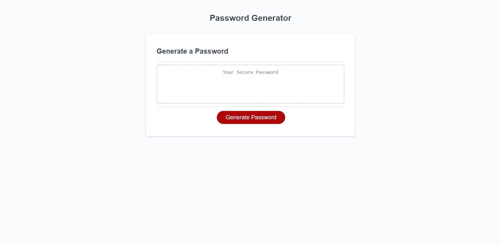

# passwordGen README

## Requirements
* Randomly generate a password that meets certain criteria

* Use a series of prompts for password criteria

    * lowercase, uppercase, numeric, and/or special characters

* Allowable password length between 8 and 128 characters

* At least one character type should be selected after all prompts are answered

* Display password in an alert or written to the page

## Files & directories

* index&#46;html

* script&#46;js

* style&#46;css

* README&#46;md

## Links

#####[Link to webpage](https://jamesjtuckbc.github.io/passwordGen-Tuck/)
#####[Link to repo](https://github.com/jamesjtuckbc/passwordGen-Tuck)
### Pages

#### index.html

- - -

© 2020 Jorgen Tuck